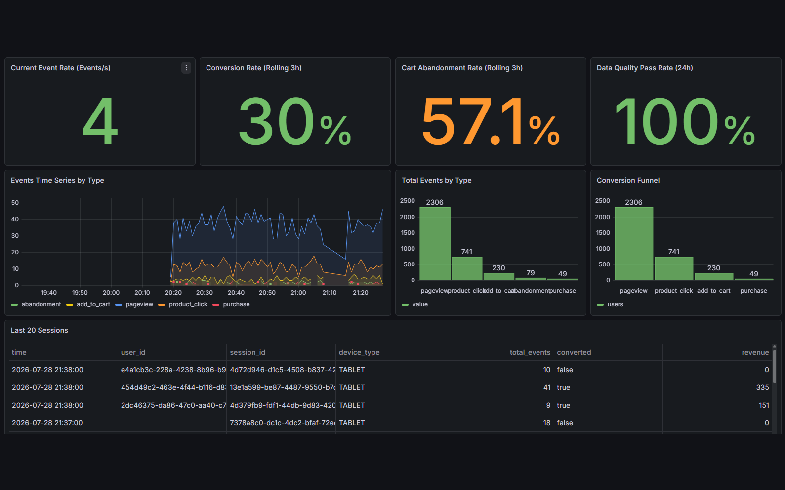
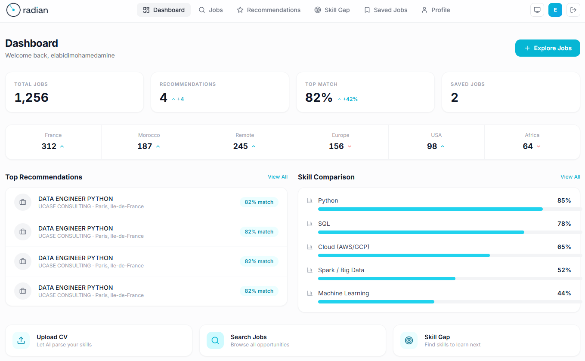
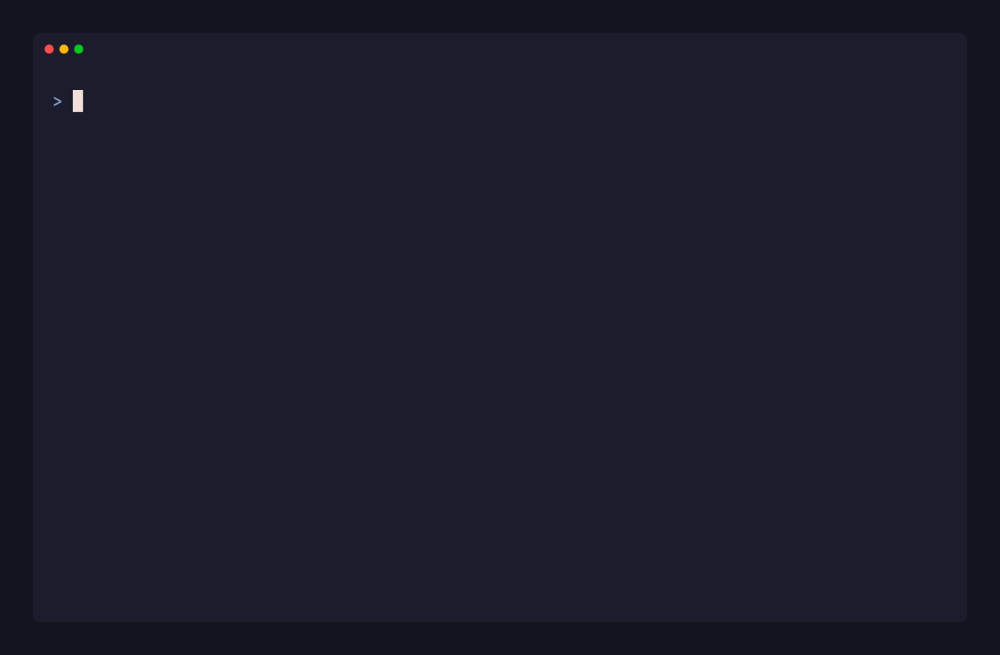

<h1>Rida Aderkane</h1>

 

I build **data platforms end to end** — streaming ingestion, distributed processing, orchestration,
and the AI layer on top. Most of my work lives at the point where **data engineering meets applied AI**:
real-time pipelines feeding analytics, and retrieval systems that make that data useful to people and agents.

Everything below is a system I designed, built, and ran — not a tutorial follow-along.

&nbsp;&nbsp;&nbsp;&nbsp;&nbsp;&nbsp;&nbsp;&nbsp;&nbsp;&nbsp;&nbsp;&nbsp;

&nbsp;&nbsp;&nbsp;&nbsp;&nbsp;&nbsp;&nbsp;&nbsp;&nbsp;&nbsp;&nbsp;&nbsp;

## Featured Projects

<table>
<tr>

<td width="50%" valign="top">

<h3>StreamMart</h3>

Real-time e-commerce analytics on a lambda architecture. Kafka feeds four independent Spark Structured Streaming jobs into PostgreSQL and a MinIO data lake, reconciled nightly by Airflow.

<b>27 Docker services · 36 automated tests · 9 bugs caught in live validation</b>

<a href="https://github.com/Ridadata/streammart"><b>View repository →</b></a>
</td>

<td width="50%" valign="top">

<h3>Job Intelligent</h3>

End-to-end recruitment intelligence platform. Aggregates job offers via APIs and scrapers, extracts skills from CVs with NLP, and ranks candidate matches using embedding similarity.

<b>Medallion architecture · Airflow DAGs · FastAPI + Power BI surface</b>

<a href="https://github.com/Ridadata/job-intelligent"><b>View repository →</b></a>
</td>

</tr>
<tr>

<td width="50%" valign="top">

<h3>Enterprise RAG Assistant</h3>

Retrieval-augmented search over an enterprise knowledge base. Returns grounded answers with inline citations, plus a knowledge-base manager and admin analytics for retrieval quality.

<b>Cited answers · hybrid retrieval · admin analytics</b>

<a href="https://github.com/Ridadata/enterprise-rag-assistant"><b>View repository →</b></a>
</td>

<td width="50%" valign="top">

<h3>MCP Data Profiler</h3>

An MCP server that lets AI agents understand a dataset without reading it. Returns a bounded JSON profile — types, ranges, null rates, quality flags — instead of pasted rows.

<b>Published on PyPI · 645 MB → 13 KB profile · CSV, Parquet, JSON, Excel</b>

<a href="https://github.com/Ridadata/mcp-data-profiler"><b>View repository →</b></a>
</td>

</tr>
</table>

## Also Building

<table>
<tr>
<td width="34%" valign="top">
<b><a href="https://github.com/Ridadata/whatbreaks">WhatBreaks</a></b> 
Static breaking-change analysis for dbt. Column-level blast radius in CI, with no warehouse or credentials required.  
<code>Python</code> <code>SQLGlot</code> <code>dbt</code>
</td>
<td width="33%" valign="top">
<b><a href="https://github.com/Ridadata/doc-doctor">Doc Doctor</a></b> 
A GitHub Action that executes the code examples in your docs and fails the PR when they break.  
<code>TypeScript</code> <code>GitHub Actions</code>
</td>
<td width="33%" valign="top">
<b><a href="https://github.com/Ridadata/procurement-pipeline">Procurement Pipeline</a></b> 
Big-data procurement analytics pipeline built on a Hadoop and Presto stack, orchestrated with Airflow.  
<code>Hadoop</code> <code>Presto</code> <code>Airflow</code>
</td>
</tr>
</table>

## Tech Stack

<table>
<tr>
<td valign="middle"><b>Languages</b></td>
<td>

</td>
</tr>
<tr>
<td valign="middle"><b>Data Engineering</b></td>
<td>

</td>
</tr>
<tr>
<td valign="middle"><b>AI &amp; ML</b></td>
<td>

</td>
</tr>
<tr>
<td valign="middle"><b>Storage</b></td>
<td>

</td>
</tr>
<tr>
<td valign="middle"><b>Infrastructure</b></td>
<td>

</td>
</tr>
<tr>
<td valign="middle"><b>Observability</b></td>
<td>

</td>
</tr>
</table>

 

## Contribution Activity

