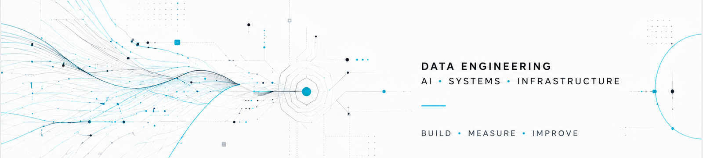
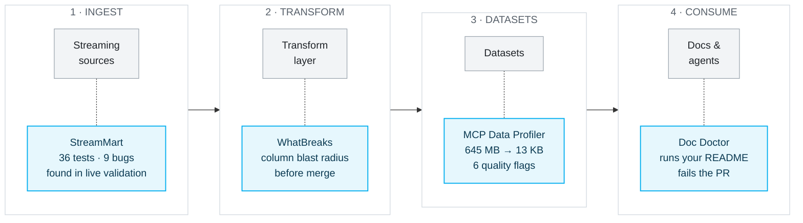

  

**Most data tooling assumes the pipeline is correct and the data is clean.**

**I build the checks that assume neither.**

 

<a href="https://github.com/Ridadata">GitHub</a>
&nbsp;·&nbsp;
<a href="https://pypi.org/project/mcp-data-profiler/">PyPI</a>

---

## 01 / THE THROUGH-LINE

Four projects, one idea: **every stage of a data platform should be able to prove it still works.**
Each tool below hardens a different stage — and each one exists because the failure it catches is
invisible until production.

---

## 02 / SELECTED WORK

<table>
<tr>

<td width="50%" valign="top">

### MCP Data Profiler

Lets an AI agent understand a dataset **without reading it** — a bounded JSON profile instead of pasted rows.

**645 MB → 13 KB.** 6 data-quality flags. CSV, Parquet, JSON, Excel.

`Python` · `MCP` · `pandas` · `PyArrow`

**[VIEW PROJECT →](https://github.com/Ridadata/mcp-data-profiler)** · `pip install mcp-data-profiler`

</td>

<td width="50%" valign="top">

### WhatBreaks

Static breaking-change analysis for dbt. Column-level blast radius in CI — **no warehouse, no credentials.**

Benchmarked on 7 public dbt projects: **75.6%** exact column resolution, **zero** false positives.

`Python` · `SQLGlot` · `dbt` · `CI`

**[VIEW PROJECT →](https://github.com/Ridadata/whatbreaks)**

</td>

</tr>

<tr>

<td width="50%" valign="top">

### StreamMart

Real-time e-commerce analytics on a lambda architecture. Built for **operational durability, not syntax demos.**

27 Docker services, 36 automated tests, and a multi-hour live validation that surfaced **9 bugs code review missed.**

`Kafka` · `Spark` · `MinIO` · `Airflow`

**[VIEW PROJECT →](https://github.com/Ridadata/streammart)**

</td>

<td width="50%" valign="top">

### Doc Doctor

A GitHub Action that **executes the code examples in your docs** and fails the PR when they break.

Tag a fenced block `verify`. Node, Python, and Bash — zero extra setup on GitHub runners.

`TypeScript` · `GitHub Actions`

**[VIEW PROJECT →](https://github.com/Ridadata/doc-doctor)**

</td>

</tr>
</table>

---

## 03 / ALSO SHIPPED

| Project | What it does | Stack |
|---|---|---|
| **[Job Intelligent](https://github.com/Ridadata/job-intelligent)** | Recruitment intelligence platform — aggregates offers, extracts skills from CVs with NLP, ranks matches by embedding similarity | `Python` · `Scrapy` · `Airflow` · `PostgreSQL` |
| **[Enterprise RAG Assistant](https://github.com/Ridadata/enterprise-rag-assistant)** | Document search and grounded answers over internal corpora | `Python` · `RAG` · `Vector Search` |
| **[Procurement Pipeline](https://github.com/Ridadata/procurement-pipeline)** | Big-data procurement pipeline on a Hadoop/Presto stack | `Hadoop` · `Presto` · `Airflow` |

---

## 04 / STACK

  

 

Beyond the icons — the parts of the stack that do the real work:

| | |
|---|---|
| **Data** | dbt · Dagster · Iceberg · SQLGlot · Structured Streaming |
| **AI** | MCP · RAG · NLP · Vector Search · Embeddings |
| **Reliability** | OpenTelemetry · idempotent writes · bounded-state watermarks · CI gates |

---

## 05 / NOW

Currently building **[WhatBreaks](https://github.com/Ridadata/whatbreaks)** — pushing column-lineage
resolution past 75.6% and expanding the rule set beyond the first four.

Interested in **reliable data systems, developer tooling, and the point where Data Engineering meets AI.**
Open to collaboration on any of the above.

 

**RIDA ADERKANE**

